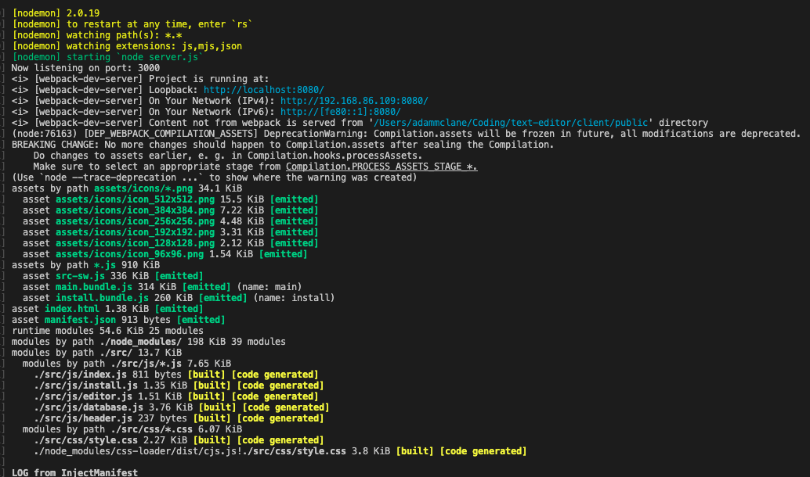
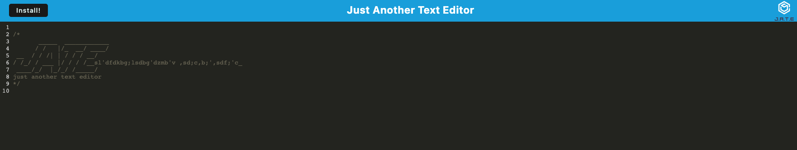
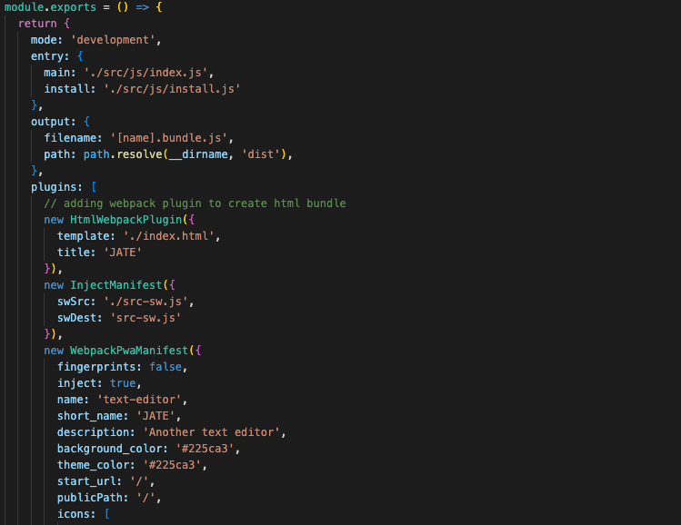

# Text Editor

[](https://opensource.org/licenses/MIT)

  # Text Editor (PWA)
  
  ## Deployed link
  https://mclanea92-text-editor.herokuapp.com/
  
  
  ## Description
    This App is created to make a online application for text editing.  You can also download it to your computer for installation and run offline. 
  
  
  ## Installation
  To install the correct npm packages, you will clone this code to your local machine and in the terminal input "npm i" or "npm install" and they will download all the approprate packages needed for this application to run.
  
  ## Acceptance Criteria
    ```md
    GIVEN a text editor web application
    WHEN I open my application in my editor
    THEN I should see a client server folder structure
    WHEN I run `npm run start` from the root directory
    THEN I find that my application should start up the backend and serve the client
    WHEN I run the text editor application from my terminal
    THEN I find that my JavaScript files have been bundled using webpack
    WHEN I run my webpack plugins
    THEN I find that I have a generated HTML file, service worker, and a manifest file
    WHEN I use next-gen JavaScript in my application
    THEN I find that the text editor still functions in the browser without errors
    WHEN I open the text editor
    THEN I find that IndexedDB has immediately created a database storage
    WHEN I enter content and subsequently click off of the DOM window
    THEN I find that the content in the text editor has been saved with IndexedDB
    WHEN I reopen the text editor after closing it
    THEN I find that the content in the text editor has been retrieved from our IndexedDB
    WHEN I click on the Install button
    THEN I download my web application as an icon on my desktop
    WHEN I load my web application
    THEN I should have a registered service worker using workbox
    WHEN I register a service worker
    THEN I should have my static assets pre cached upon loading along with subsequent pages and static assets
    WHEN I deploy to Heroku
    THEN I should have proper build scripts for a webpack application
    ```

  ## Technologies
   - express
   - mongoose
   - webpack.config
   - manifest
   - service worker

## Github
https://github.com/mclanea92/text-editor
  ## Usage
  To use this app, simply open it up in the browser (with the deployed app link at the top of this readme) and then you are good to go. For offline use, the user can go to the link and hit the "install" button at the top left corner of the page. 
  
  
  

  ## Questions

  If you have any questions please feel free to reach out to me:

  Email: mclanea92@gmail.com

   ## Screenshots
   This first screenshot is the terminal showing after you run npm run start:dev and the terminal building the webpack
   

   This screenshot is the site itself deployed on heroku
   

   This final screenshot is the code being brought together in the webpack config to create the site.
   


## License
    MIT License

    Copyright (c) 2022 Adam McLane

    Permission is hereby granted, free of charge, to any person obtaining a copy
    of this software and associated documentation files (the "Software"), to deal
    in the Software without restriction, including without limitation the rights
    to use, copy, modify, merge, publish, distribute, sublicense, and/or sell
    copies of the Software, and to permit persons to whom the Software is
    furnished to do so, subject to the following conditions:

    The above copyright notice and this permission notice shall be included in all
    copies or substantial portions of the Software.

    THE SOFTWARE IS PROVIDED "AS IS", WITHOUT WARRANTY OF ANY KIND, EXPRESS OR
    IMPLIED, INCLUDING BUT NOT LIMITED TO THE WARRANTIES OF MERCHANTABILITY,
    FITNESS FOR A PARTICULAR PURPOSE AND NONINFRINGEMENT. IN NO EVENT SHALL THE
    AUTHORS OR COPYRIGHT HOLDERS BE LIABLE FOR ANY CLAIM, DAMAGES OR OTHER
    LIABILITY, WHETHER IN AN ACTION OF CONTRACT, TORT OR OTHERWISE, ARISING FROM,
    OUT OF OR IN CONNECTION WITH THE SOFTWARE OR THE USE OR OTHER DEALINGS IN THE
    SOFTWARE.